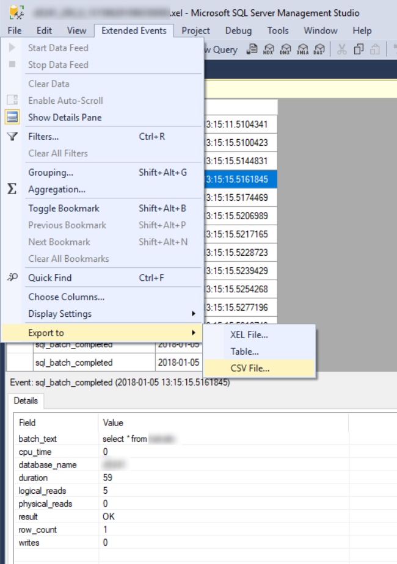
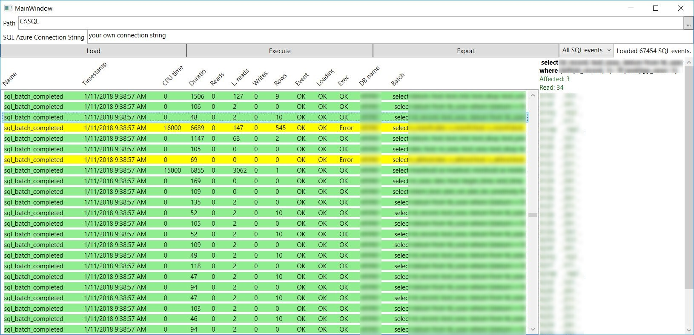
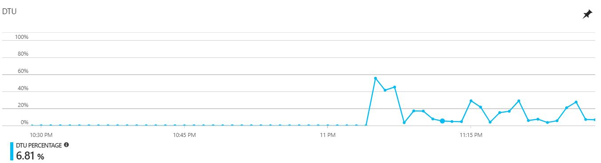
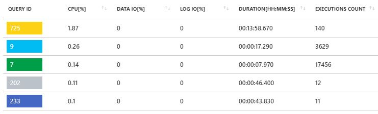

# SQL traffic simulator

This tool is suitable when you need to compare performance of two different SQL servers e.g. OnPrem MSSQL vs Azure SQL Database.

## Getting Started

- Download source files (XAML, C#, WPF, .NET 4.6.1)
- To the ```.csproj``` level in SQLEventsExecutor folder add ```Connections.cs``` file with a following content. You can use default strings when you are going to run tool frequently.

```
using System;
using System.Collections.Generic;
using System.Linq;
using System.Text;
using System.Threading.Tasks;

namespace SQLEventsExecutor
{
    public static class Connections
    {
        public static Dictionary<string, string> ConnectionDict = new Dictionary<string, string>()
        {
            {"SQLDefault", @"your connection string"},
            {"CSVDefault", @"your default path"}
        };
    }
}
```
- Compile the project SQLEventsExecutor.csproj
- Place ```*.CSV``` files with converted SQL Events log into folder you want to use for testing. Typicaly same as CSVDefault string.
- Create a folder ```Export``` inside the folder where ```*.CSV``` files are located.

### Prerequisites

- It is needed to convert SQL Event logs you got from the source SQL server and want to simulate on a different SQL server from ```*.XEL``` to ```*.CSV```. To do this open ```*.XEL``` file in Microsoft SQL Server Management Studio and select Extended Events\Export to\CSV file... 

- You may find helpful to check a compatibility of your database schema with target platform. In case of Azure SQL database you may want to try following urls:
    - To compare DB engines try Azure SQL Database features https://docs.microsoft.com/en-us/azure/sql-database/sql-database-features
    - To investigate language compatibility try Transact-SQL differences https://docs.microsoft.com/en-us/azure/sql-database/sql-database-transact-sql-information
    - To analyze target platform before migrating try SQL Server Data Tools (SSDT) https://docs.microsoft.com/en-us/sql/ssdt/download-sql-server-data-tools-ssdt
- To have prepared a database on target SQL server with exactly same schema and as much as possible similar data. In case that the source server is MS SQL server and target server is Azure SQL database https://azure.microsoft.com/en-us/services/sql-database/ it is needed to use ```.bacpac``` format for backup and restore instead of ```.bak```

### How to use the tool
- Launch compiled ```SQLEventsExecutor.exe```
- Fill/update a path field and a SQL connection string field if need
- Click on ```Load``` button and check loaded events from all ```*.CSV``` located in the folder path
- Click on ```Execute``` button and check execution results

- Click on ```Export``` button to create ```*.CSV``` file in ```Export``` folder
- Open exported ```\Export\SQLEventsExeExport_yyyy_MM_dd_HH_mm_ss.csv``` in Excel and continue with results analysis. In case of larger files you would like to avoid Out of memory error during double click on .CSV file. It is batter to open empty Excel and then select  ```Data\From Text/CSV```in the ribbon menu.
- Observe performance on target/tested SQL server to compare to the source SQL server and optimize particular queries.


- Repeate tests in Azure with various SQL Database configuration and estimate SQL running costs more precisely

### Future improvement
- Align execution timing exactly to the timing of the source event log timestamp
- Measure duration of execution and comparing to the duration of source event log
- Multithread execution
- Ignore/skip empty event log records
- Better main window title :)

## Authors

* first idea and development **Filip Řehořík**
* thanks for consultancy and hints to **Miroslav Kubovčík**

